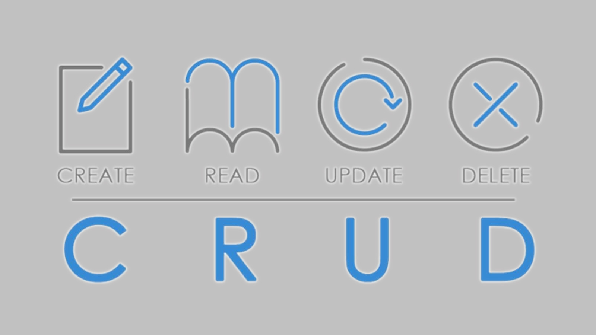

# <h1 Style=" text-align:center;color:blue"> **CRUD HTML5,CSS3 & JavaSscript** </h1>

## Projeto feito para manipulação de dados inseridos em uma tabela através de formulários.

#

## <li> HTML5: foi criado utilizando 'form' para inserir dados em uma 'table'.

### Projeto desenvolvido utilizando programação orientada a objetos , no qual foi criado classe , constructor e funções 

