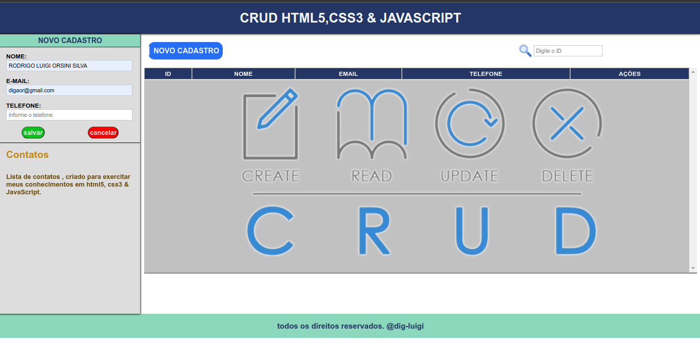

# <h1 id="top" align="center">CRUD HTML5,CSS3 & JavaSscript &nbsp; 📚</h1>

<p align="center">
  <a href="#sobre">Sobre</a> &#xa0; | &#xa0; 
  <a href="#gear-features">Features</a> &#xa0; | &#xa0;
  <a href="#books-bibliotecas">Tecnologias</a> &#xa0; | &#xa0;
  <a href="#-requisitos">Requisitos</a> &#xa0; | &#xa0;
  <a href="#checkered_flag-iniciando">Iniciando</a> &#xa0; | &#xa0;
  <a href="https://github.com/RodrigoLuigi" target="_blank">Author</a>
</p>

<br>

## Screenshots

<div align="center">
  
  
  
</div>

<br><hr>

##  _**O que desenvolvemos neste Projeto?**_

📌 Aplicação para manipulação de dados inseridos em uma tabela através de um formulário.

Desenvolvido utilizando programação orientada a objetos , no qual foi criado classe , constructor e funções 
  
Techs: **HTML**, **CSS** e **JavaScript**.

## :gear: Features

:heavy_check_mark: Cadastro de pessoa\
:heavy_check_mark: Deletar pessoa\
:heavy_check_mark: Editar pessoa\
:heavy_check_mark: Listar pessoa\
:heavy_check_mark: Listar pessoa pelo id\

## :books: Bibliotecas

_**As seguintes bibliotecas foram utilizadas neste projeto:**_

- [HTML](https://developer.mozilla.org/pt-BR/docs/Web/HTML)
- [CSS](https://developer.mozilla.org/en-US/docs/Web/CSS)
- [JavaScript](https://developer.mozilla.org/en-US/docs/Web/JavaScript)

## 📝 Requisitos

- [Git](https://git-scm.com)

## :checkered_flag: Iniciando

#### Inicializando aplicação Front-end

```bash
# Clone este projeto
$ git clone https://github.com/RodrigoLuigi/gerenciador-de-pessoas.git

# Acesse o projeto
$ cd gerenciador-de-pessoas

# Execute o projeto com Live server
http://127.0.0.1:5500
```

&#xa0;

_**Feito por <a href="https://github.com/RodrigoLuigi" target="_blank">Rodrigo Luigi</a>**_ 👨‍🚀

<a href="#top">Back to top</a>


